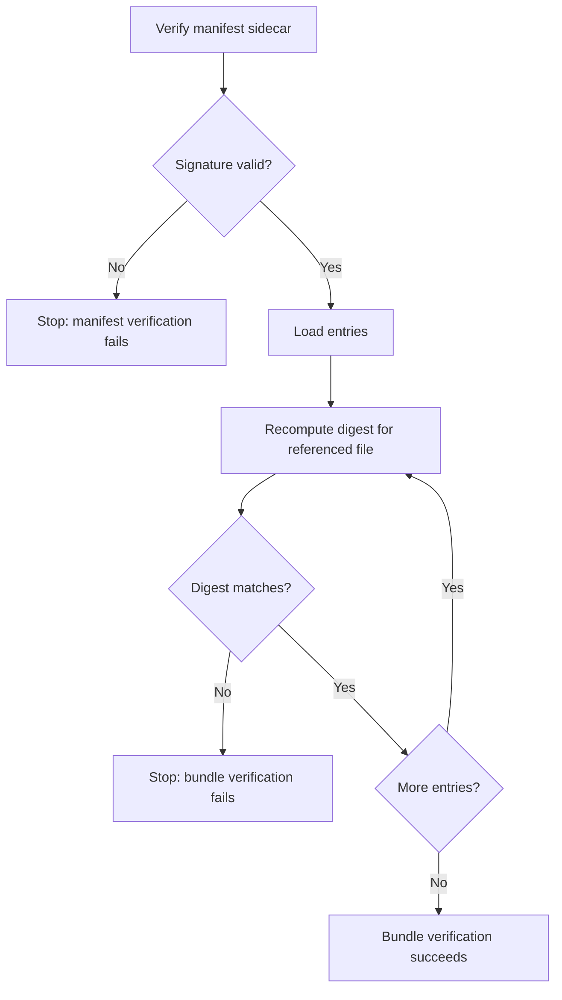

# Cross-document integrity ADR

This note goes deeper than the proposal text for Milestone 6.3. Instead of
restating the proposal, it captures a more concrete design sketch for how a
manifest-based bundle signature could work for related OSCAL files.

## Design question

When multiple OSCAL files belong to one release bundle, which of these should be
treated as the signed object?

1. Sign each file in isolation and leave dependency relationships implicit.
2. Walk the reference graph and try to sign the graph directly.
3. Create one explicit manifest that lists the shipped members and their digests,
   then sign that manifest.

This note records why option 3 currently looks like the cleanest design.

## Recommended direction

Use a signed manifest as the bundle-level integrity object.

That means:

- the existing single-file signing flow stays unchanged
- a manifest adds bundle-level integrity when needed
- the verifier does not need to infer dependencies by reading OSCAL semantics
- the shipped set is explicit, reviewable, and reproducible

## Example bundle layout

```text
release-bundle/
├── manifest.json
├── manifest.json.sig
├── ssp.json
├── profile.json
└── catalog.json
```

This layout is intentionally simple: one declared bundle root, one manifest, and
the referenced files beside it.

## Example manifest shape

Below is a sketch of what the manifest could look like. This is not a final
schema; it is an example to make the design more concrete.

```json
{
  "trestle_manifest_version": 1,
  "entries": [
    {
      "uri": "ssp.json",
      "media_type": "application/oscal+json",
      "payload_sha256": "7f5d..."
    },
    {
      "uri": "profile.json",
      "media_type": "application/oscal+json",
      "payload_sha256": "4ab1..."
    },
    {
      "uri": "catalog.json",
      "media_type": "application/oscal+json",
      "payload_sha256": "c091..."
    }
  ]
}
```

## Why a manifest is better than graph-walking for MVP+1

### Per-document isolated signing

Signing each file independently is easy, but it leaves too much ambiguity:

- the verifier does not know which related files were intended as one release
- a valid signature on one file says nothing about the integrity of the other
  files shipped beside it
- release-bundle provenance remains implicit

### Full reference-graph walking

Walking imports or references sounds attractive, but it raises difficult design
questions immediately:

- should verification fetch missing remote dependencies?
- which OSCAL relationships count as part of the signed graph?
- how should cycles, optional references, or environment-specific paths behave?

That complexity is much larger than what is needed for a practical first design.

### Signed manifest

A manifest avoids those problems by making the bundle explicit:

- the producer decides what is part of the bundle
- the verifier checks exactly that declared set
- no hidden dependency inference is required

## URI handling choices

The main unresolved design area is URI handling. The simplest and safest starting
rule is:

- support relative paths first
- resolve them from the manifest location or an agreed bundle root
- treat remote HTTPS URIs as design-only unless network fetch rules are defined

### Example resolution rules

| URI form | Example | Initial handling |
| --- | --- | --- |
| Relative path | `profile.json` | Supported |
| Nested relative path | `profiles/low/profile.json` | Supported |
| `file://` URI | `file:///bundle/profile.json` | Optional; only if bundle rules define it clearly |
| HTTPS URI | `https://example.org/profile.json` | Not part of the first verification model |

This keeps the first design local, deterministic, and easy to explain.

## Verification behavior

The intended verifier behavior is:

1. verify `manifest.json.sig`
2. load `manifest.json`
3. iterate over `entries`
4. recompute the JCS digest for each referenced file
5. compare recomputed digest with `payload_sha256`
6. fail closed on any mismatch or missing file

### Visual flow



## Failure cases worth designing early

These are the failure cases that matter most for the ADR:

| Case | Example | Expected result |
| --- | --- | --- |
| Missing file | `catalog.json` absent from bundle | Fail closed |
| Digest drift | file changed after manifest creation | Fail closed |
| Manifest valid, member invalid | signed manifest references tampered file | Fail closed |
| Unsupported URI form | remote URI in local-only verifier | Clear configuration/design error |
| Duplicate entry | same `uri` listed twice | Reject manifest as malformed |

## What this ADR intentionally avoids

This note is intentionally narrower than a full dependency-management solution.
It does not try to solve:

- semantic version resolution
- package management
- live remote fetch during default verification
- full OSCAL graph semantics inferred automatically from object references

The design target is smaller and clearer:

> verify the integrity of a declared shipped file set

## Questions to settle in a later iteration

Before implementation, these questions still need explicit answers:

- Should the manifest require stable entry ordering, or rely entirely on JCS?
- Should `media_type` be optional or mandatory?
- Should duplicate URIs be rejected during manifest validation?
- Should bundle signatures include higher-level metadata such as build ID or
  publishing context?

