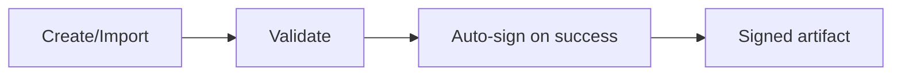
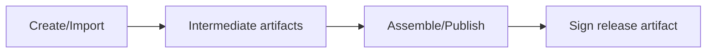

# POC-08 Signing Decision in Artifact Lifecycle

## Option 1: Explicit manual signing only

## Option 2: Automatic signing post-validation (recommended)

## Option 3: Sign during assemble/publish stage

## Recommendation

Start with **automatic signing post-validation** for core workflows.

Why:
- provides consistent trust signal with minimal user burden
- keeps migration to CI/publish-stage signing straightforward
- still allows manual overrides for exceptional cases
